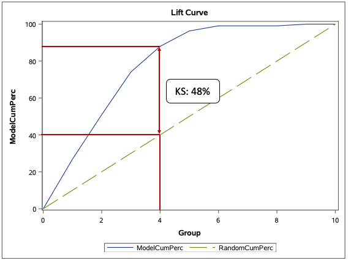

# NHL Classification Analysis

## Project Description

The analysis explored NHL team season data (url:https://www.kevinsidwar.com/iot/2017/7/1/the-undocumented-nhl-stats-api) from 1983 - 2020 to predict playoff outcomes.

The analysis used logistic regression to predict the playoff outcomes of teams that didn't make the playoffs. 

By understanding the economics of what holds teams back from making playoffs, teams can gain more transparency and perspective on what works with strategy and achieving successful campaigns in mind.

Achieving successful campaigns can potentially lead to increased revenue for all stakeholders through ticket sales, salary increases, 
endorsement deals, fair book value of the organization, greater economic activity for the represented city, etc.  

## Methods Used

1) Descriptive Statistics - used for preliminary data exploration.
2) Logistic Regression - in the process of predicting playoff outcomes, greater transparency around the features were developed for a greater understadning of the statistical economics driving teams into the playoffs.

## Results 

**Model Features**:

1) **goalsPerGame** - Average goals per game
2) **penaltyKillPercentage** - Average successful penalty kills (no goals against)
3) **shotsAllowed** - Average shots against
4) **winOutshotByOpp** - Percentage of games won when teams was outshot by opponent
5) **D1** -  winOutShootOpp > 0.483 and winOutShotByOpp > 0.421
6) **D2** - winOutShootOpp <= 0.483 and goalsPerGame <= 2.805 and goalsAgainstPerGame > 2.646

**Model Target**:

1) **failed_playoff_flag** -  Failed Seasons By Not Making Playoffs

**Model Results on Test Data**:

* **Accuracy:** 0.88
* **Percision:** 0.83
* **Recall:** 0.84
* **F1:** 0.84

* **Kolmogorov–Smirnov Measure (KS):** 48% at the 4th decile, a cumulative percantage 2.2 (84% (model) - 40% (random model) times greater than a random model.

## Technologies 

1) SAS 
2) Python
3) SAS Studio
4) Jupyter Notebook
5) Anaconda Environment

## Order of Analysis

1) **NHL_Univariate.sas** - All univariate pdf files
2) **NHL_Bivariate.sas** - All bivariare pdf files
3) **NHL_Logistic_Regression.sas** - Train and test pdf files

## Directory Files

1) **NHL_API.ipynb** - NHL data base API.
2) **Macros.sas** - Macro functions.
3) **NHL_Univariate.sas** - Univariate analysis in SAS.
4) **NHL_Numeric_Univariate.pdf** - Numeric univariate analysis pdf.
5) **NHL_Categorical_Univariate.pdf** - Categorical univariate analysis pdf.
6) **NHL_Bivariate.sas** - Bivariate analysis in SAS.
7) **NHL_Numeric_Bivariate.pdf** -  Numeric bivariate analysis pdf.
8) **NHL_Categorical_Bivariate.pdf** -  Categorical bivariate analysis pdf.
9) **NHL_Logistic_Regression.sas** - Logistic regression analysis in SAS.
10) **NHL_Train_Model.pdf** - Logistic regression train results.
11) **NHL_Test_Model.pdf** -  Logistic regression test results.
12) **Decision_Tree_Plots** - Chi-square automatic interaction detector (CHAID) tree algorithm used to explore data for derived variables.

